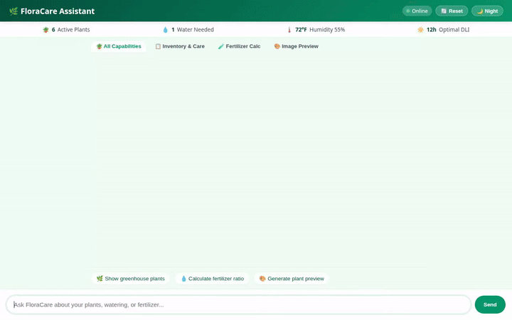

# 🌿 FloraCare Greenhouse Assistant

An intelligent, multi-modal greenhouse management and botanical care assistant built with Google's **Agent Development Kit (ADK)** and deployed on **Vertex AI Agent Engine**.



---

## 🌟 Overview

**FloraCare** serves as an automated digital plant expert and inventory companion for greenhouse managers, horticulturists, and plant enthusiasts. Powered by Gemini 2.5 Flash, FloraCare seamlessly integrates persistent cross-session memory, real-time database management, automated liquid fertilizer calculation, live botanical taxonomy lookups, multi-modal image and video generation, and rich A2UI interactive cards.

---

## 🚀 Key Features & Integrated Google Cloud Services

FloraCare integrates the following production Google Cloud services and AI tools:

### 🧠 Cross-Session Memory (Vertex AI Memory Bank)
* **Service**: `VertexAiMemoryBankService` & `PreloadMemoryTool`
* **Capabilities**: Recalls user preferences, growing locations/USDA hardiness zones, plant care history, and user plant allergies/sensitivities across independent chat sessions.
* **Callback**: Automatically extracts and persists user memories to Memory Bank on turn completion (`generate_memories_callback`).

### 🪴 Greenhouse Inventory Management (Google Cloud Firestore)
* **Service**: `google.cloud.firestore` (`greenhouse_plants` collection)
* **Capabilities**:
  * `list_plants`: Streams active plant inventory summary from Firestore.
  * `get_plant_details`: Fetches complete document specs, temperature/humidity tolerance, and care notes for a plant ID.
  * `add_or_update_plant`: Creates new plant records or updates existing inventory details.
  * `log_plant_watering`: Logs watering events with timestamp and handler identity (`last_watered`).

### 🖼️ & 🎥 Generative Multi-Modal Media (Gemini Models + Cloud Storage)
* **Services**: `google.genai`, `google.cloud.storage` (`floracare-greenhouse-assets-027f80` bucket)
* **Tools**:
  * `generate_plant_image`: Generates botanical catalog images via `gemini-3.1-flash-lite-image`. Saves output as a session artifact (`tool_context.save_artifact`) and uploads bytes directly to public Cloud Storage.
  * `generate_plant_video`: Generates short MP4 botanical clips/timelapses using Google's Omni model (`gemini-omni-flash-preview`) via the Vertex AI Interactions API in the `global` region. Saves artifacts and uploads bytes to public Cloud Storage.

### 🎛️ Dynamic UI Cards (A2UI - Agent to User Interface v0.8)
* **Capabilities**: Emits structured A2UI JSON cards and widgets parsed natively by ADK Web and the custom chat web application using `A2uiSchemaManager` and `a2ui_callback`.

### 🧪 Botanical & Environmental Utilities
* **`calculate_fertilizer_dosage`**: Calculates precise liquid fertilizer concentrate dilution ratios (mL/L) tailored to water batch volume and growth stage (*seedling*, *vegetative*, *flowering*, *dormant*).
* **`lookup_botanical_taxonomy`**: Fetches real scientific classification data (family, genus, order, canonical name) via the public **GBIF** (Global Biodiversity Information Facility) API.
* **`AgentEngineSandboxCodeExecutor`**: Executes code safely in the Agent Runtime container.

---

## 📂 Project Structure

```
floracare-greenhouse-assistant/
├── app/                        # Core agent code
│   ├── agent.py               # Main agent definition, model config, and callbacks
│   ├── firestore_tools.py     # Firestore, GCS, GBIF, and GenAI media tools
│   ├── a2ui_utils.py          # A2UI schema manager & formatting callback
│   └── fast_api_app.py        # FastAPI proxy app
├── frontend/                   # Custom web application
│   ├── main.py                # FastAPI frontend server
│   └── static/
│       ├── index.html         # Rich UI with greenhouse dashboard, theme toggle, and chips
│       └── app.js             # Event listeners & A2UI card renderer
├── agents-cli-manifest.yaml    # Deployment manifest for agents-cli
├── pyproject.toml              # Dependencies and project metadata
├── demo.gif                    # Loop demo video preview
└── README.md                   # Project documentation
```

---

## 🛠️ Local Development & How to Run

### Prerequisites
* **Python 3.10+**
* **`uv`**: Fast Python package manager (`pip install uv`)
* **`google-agents-cli`**: Installed via `uv tool install google-agents-cli`
* **Google Cloud SDK (`gcloud`)**: Authenticated with Vertex AI, Firestore, and GCS permissions.

### 1. Installation & Environment Setup

Clone the repository and install dependencies:

```bash
uv sync
agents-cli install
```

Set required environment variables:

```bash
export GOOGLE_CLOUD_PROJECT="your-gcp-project-id"
export GOOGLE_CLOUD_LOCATION="us-east1"
```

### 2. Run Agent Locally (ADK Playground)

Test the agent interactively with auto-reloading in the ADK web interface:

```bash
agents-cli playground
```

### 3. Run Custom Web Application

To launch the custom web frontend locally:

```bash
export AGENT_ENGINE_RESOURCE_NAME="projects/YOUR_PROJECT_ID/locations/us-east1/reasoningEngines/YOUR_RESOURCE_ID"
export AGENT_DIRECTORY="app"

cd frontend
python3 main.py
```

Open your browser to `http://localhost:8080` (or the local port printed by Uvicorn).

---

## 🚀 Deployment

Deploy the agent directly to **Vertex AI Agent Engine** using `agents-cli`:

```bash
agents-cli deploy
```

Deploy the frontend proxy to Cloud Run:

```bash
gcloud run deploy floracare-frontend \
  --source ./frontend \
  --set-env-vars AGENT_ENGINE_RESOURCE_NAME="projects/YOUR_PROJECT_ID/locations/us-east1/reasoningEngines/YOUR_RESOURCE_ID",AGENT_DIRECTORY="app" \
  --allow-unauthenticated \
  --region us-east1
```

---

## 📜 License

Distributed under the Apache 2.0 License. See `LICENSE` for details.
